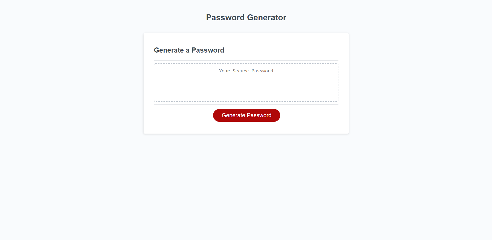

# Password Generator

## Description

This is a website for generating secure random passwords within selected criteria.

## Visuals

This is the website layout:

## Link

[nanea808.github.io/third-challenge-javascript](https://nanea808.github.io/third-challenge-javascript/)

## Installation

N/A

## Usage

Step 1: Click "Generate Password" button!

Step 2: Type desired password size in box and click "OK" to confirm.

Step 3: Click "OK" to confirm desired character types and password will apear in center text box.

## Credits

N/A

## License

Please refer to the LICENSE in the repo.
